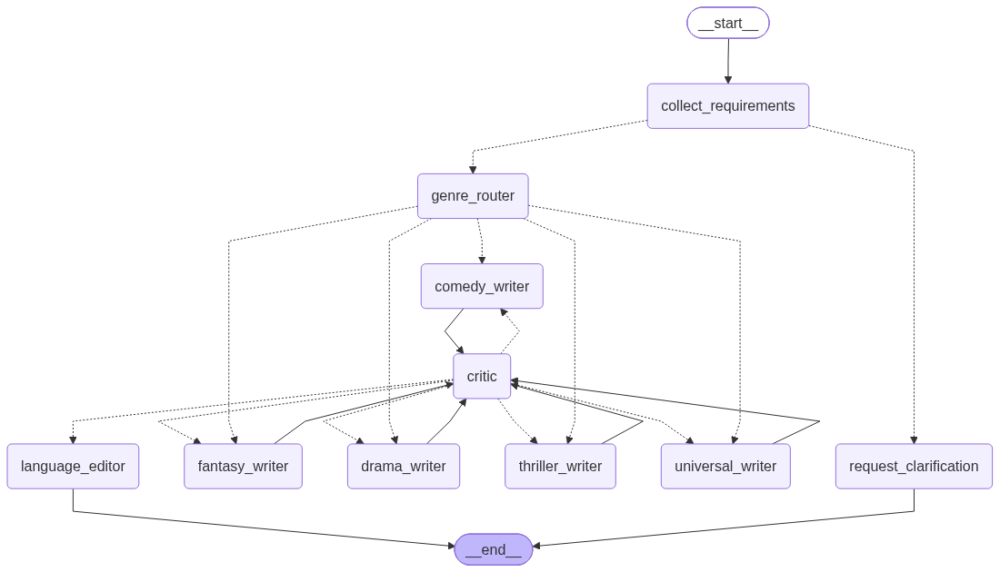

# Synopsis Generator LangGraph

Генератор синопсисов, построенный на базе **LangGraph**

Приложение принимает описание идеи, жанр, стилистику, язык и требуемый объем текста, после чего направляет запрос специализированному узлу-писателю.

Сгенерированный текст проверяется отдельным узлом-критиком. Если результат не соответствует исходному техническому заданию, критик возвращает текст писателю на повторную доработку.

После успешного прохождения проверки или достижения максимального количества итераций текст передается языковому редактору.

Проект использует локальную LLM **Qwen3 8B**, запущенную через **Ollama** с использованием GPU.

---

## Возможности

На текущем этапе реализовано:

- построение workflow с помощью LangGraph;
- хранение общего состояния графа через `TypedDict`;
- проверка полноты входных данных (пока действуют через полностю ручной узел, но в будущем планирую попробовать использовать LLM для проверки полноты ТЗ);
- маршрутизация через условные ребра по жанру;
- узлы-писатели по жанрам + универсальный;
- генерация синопсиса через локальную LLM;
- отдельный узел-критик;
- структурированный ответ критика через Pydantic;
- повторные проходы `Writer - Critic - Writer`;
- ограничение максимального количества итераций;
- отдельный языковой редактор;
- FastAPI-интерфейс;
- Swagger UI;
- проверка соединения с Ollama и PostgreSQL;
- визуализация реального скомпилированного LangGraph через Mermaid;
- экспорт графа в `.mmd` и `.png`.

---

## Архитектура LangGraph

Основной workflow выглядит следующим образом:

```text
START
  │
  ▼
collect_requirements
  │
  ├── данных недостаточно
  │         │
  │         ▼
  │ request_clarification
  │         │
  │         ▼
  │        END
  │
  └── данных достаточно
            │
            ▼
       genre_router
            │
      ┌─────┼──────────────┐
      │     │              │
      ▼     ▼              ▼
   fantasy drama        thriller
   writer  writer        writer
      │     │              │
      ├─────┼──────────────┤
      │     │              │
      ▼     ▼              ▼
   comedy_writer     universal_writer
            │
            ▼
          critic
            │
       ┌────┴─────┐
       │          │
    REVISE       PASS
       │          │
       ▼          ▼
selected_writer  language_editor
       │          │
       └─► critic │
                  ▼
                 END
```

Ключевая особенность графа - циклический переход:

```text
Writer - Critic - Writer
```

Если критик считает результат неудовлетворительным, текущая версия текста вместе с последними замечаниями отправляется обратно тому же специализированному писателю.

При этом предыдущие версии текста и предыдущие отзывы критика не передаются в новый контекст.

Writer получает только:

```text
Исходное ТЗ
+
Текущая версия
+
Последние замечания критика
```

Critic получает:

```text
Исходное ТЗ
+
Текущая версия
```

---

## Визуализация графа

Граф экспортируется непосредственно из скомпилированного LangGraph.



Mermaid-исходник:

```text
artifacts/synopsis_graph.mmd
```

PNG:

```text
artifacts/synopsis_graph.png
```

Для повторной генерации:

```bash
docker compose exec api \
  python -m app.graph.export_mermaid
```

Экспорт выполняется через:

```python
synopsis_graph.get_graph().draw_mermaid()
```

и:

```python
synopsis_graph.get_graph().draw_mermaid_png()
```

---

## Узлы графа

### `collect_requirements`

Проверяет наличие обязательных входных параметров:

- идея;
- жанр;
- стиль;
- язык;
- желаемый объем.

LLM на этом этапе не используется.

Если часть данных отсутствует, выполнение направляется в `request_clarification`.

---

### `request_clarification`

Формирует сообщение со списком недостающих параметров.

На текущем этапе после этого выполнение завершается.

В дальнейшем планируется использование `interrupt()` LangGraph для приостановки workflow и продолжения после получения ответа пользователя.

---

### `genre_router`

Определяет специализированного писателя в зависимости от жанра.

Поддерживаются:

- `fantasy_writer`;
- `drama_writer`;
- `thriller_writer`;
- `comedy_writer`;
- `universal_writer`.

Если жанр не распознан, используется `universal_writer`.

---

### `Writer Nodes`

Узлы:

```text
fantasy_writer
drama_writer
thriller_writer
comedy_writer
universal_writer
```

используют общую функцию `_run_writer()`.

Каждому писателю передается отдельная специализация.

Например:

```text
thriller_writer
```

ориентирован на:

- напряжение;
- опасность;
- неопределенность;
- повышение ставок.

При первом вызове Writer создает синопсис с нуля.

При повторном вызове получает текущую версию текста и последние замечания критика.

---

### `critic`

Проверяет текущий синопсис по следующим критериям:

1. соответствие исходной идее;
2. соответствие жанру;
3. соответствие стилистике;
4. логичность событий;
5. наличие центрального конфликта;
6. мотивация персонажей;
7. связность повествования;
8. выразительность истории;
9. соответствие требуемому языку;
10. соблюдение формальных требований пользователя, включая объем и количество абзацев.

Critic использует структурированный ответ:

```text
score
must_revise
issues
revision_instructions
```

Если оценка ниже требуемой или модель считает необходимой переработку, граф возвращается к выбранному Writer.

Максимальное количество повторных проходов ограничивается параметром:

```text
max_revisions
```

---

### `language_editor`

Выполняет финальную языковую обработку текста.

Редактор исправляет:

- грамматику;
- орфографию;
- пунктуацию;
- лексические повторы;
- неестественные формулировки;
- тяжелые конструкции.

Редактору запрещено изменять:

- сюжет;
- персонажей;
- события;
- центральный конфликт;
- смысл текста.

Если текст прошел Critic:

```text
status = completed
```

Если лимит итераций закончился, но Critic не одобрил результат:

```text
status = completed_with_warnings
```

---

## Состояние графа

Общее состояние описано через `SynopsisState`

Основные группы данных:

```text
Исходное ТЗ
├── idea
├── genre
├── style
├── language
└── length

Маршрутизация
└── selected_writer

Рабочий текст
└── draft

Critic
├── critique_passed
├── critique_score
├── critique_issues
└── revision_instructions

Контроль цикла
├── revision_count
└── max_revisions

Результат
├── final_text
└── status
```

---

## Используемая LLM

Основная модель:

```text
qwen3:8b
```

Модель запускается локально через Ollama.

Используются три отдельных экземпляра `ChatOllama` с разными настройками.

### Writer

```text
temperature = 0.6
reasoning = False
```

Используется для творческой генерации и переработки текста.

### Critic

```text
temperature = 0.1
reasoning = False
```

Используется для более стабильной оценки результата.

### Language Editor

```text
temperature = 0.0
reasoning = False
```

Используется для максимально детерминированной языковой редакторской обработки.

На тестовом оборудовании используется:

```text
NVIDIA GeForce RTX 4060 Laptop
VRAM: 8 GB
```

При работе `qwen3:8b` Ollama сообщает:

```text
PROCESSOR: 100% GPU
CONTEXT: 4096
MODEL SIZE: ~5.6 GB
```

---

## Технологический стек

- Python 3.13
- LangGraph
- LangChain Ollama
- Ollama
- Qwen3 8B
- FastAPI
- Uvicorn
- Pydantic
- PostgreSQL 16
- Psycopg
- Docker
- Docker Compose
- Mermaid

---

## Структура проекта

```text
synopsis-generator-langgraph
├── Dockerfile
├── README.md
├── artifacts
│   ├── synopsis_graph.mmd
│   └── synopsis_graph.png
├── compose.yaml
├── requirements.txt
└── src
    └── app
        ├── __init__.py
        ├── api
        │   ├── __init__.py
        │   └── schemas.py
        ├── config.py
        ├── graph
        │   ├── __init__.py
        │   ├── builder.py
        │   ├── export_mermaid.py
        │   ├── llm.py
        │   ├── nodes.py
        │   ├── routes.py
        │   └── state.py
        └── main.py

5 directories, 18 files
```

---

## Инфраструктура

Ollama и PostgreSQL вынесены в отдельный инфраструктурный Docker Compose проект:

```text
wata-infrastructure
├── wata-ollama
└── wata-postgres
```

Приложение запускается отдельно:

```text
synopsis-generator-langgraph
└── synopsis-generator-api
```

Все контейнеры подключаются к общей внешней Docker-сети:

```text
wata-infra
```

Внутри Docker приложение обращается к сервисам по адресам:

```text
http://ollama:11434
postgres:5432
```

С хоста:

```text
Ollama:
127.0.0.1:11434

PostgreSQL:
127.0.0.1:5432

FastAPI:
127.0.0.1:8000
```

---

## Запуск приложения

Сначала должна быть запущена инфраструктура:

```bash
cd /mnt/c/WATA/Infrastructure

docker compose up -d
```

Затем приложение:

```bash
cd /mnt/c/WATA/Internship/synopsis-generator-langgraph

docker compose up -d
```

Проверка:

```bash
docker compose ps
```

---

## Проверка API

Health check:

```text
GET /health
```

Проверка инфраструктурных зависимостей:

```text
GET /health/dependencies
```

---

## Swagger UI

После запуска приложения документация FastAPI доступна по адресу:

```text
http://127.0.0.1:8000/docs
```

Через Swagger можно отправлять запросы генератору без использования `curl`.

---

## Генерация синопсиса

Endpoint:

```text
POST /api/v1/synopsis
```

Пример запроса:

```json
{
  "idea": "Архивист обнаруживает древнюю рукопись, изменения в которой переписывают его собственное прошлое.",
  "genre": "триллер",
  "style": "мрачный, атмосферный, кинематографичный",
  "language": "русский",
  "length": "короткий синопсис, 3-5 абзацев",
  "max_revisions": 3
}
```

Пример результата:

```json
{
  "status": "completed",
  "selected_writer": "thriller_writer",
  "draft": "...",
  "final_text": "...",
  "critique_passed": true,
  "critique_score": 8,
  "critique_issues": [],
  "revision_count": 1,
  "clarification_message": null
}
```

---

## Количество узлов и ребер

Граф содержит:

```text
10 функциональных узлов
```

С учетом служебных узлов:

```text
START
END
```

на визуализации отображается:

```text
12 узлов
```

В скомпилированной визуализации графа присутствует:

```text
21 направленный переход
```

В число переходов входят:

- обычные ребра;
- условная маршрутизация;
- переходы к специализированным Writer;
- циклические переходы `Critic → Writer`;
- переходы к `END`.
